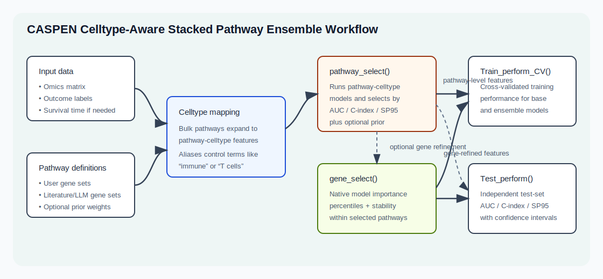

```{r, include = FALSE}
knitr::opts_chunk$set(
  collapse = TRUE,
  comment = "#>"
)
```

This portal is the public entry point for **CASPEN**, a celltype-aware stacked
pathway-guided ensemble prediction package. It is designed for collaborators
who want to understand the method, run a small demonstration, and find the
right R functions for a full analysis.

## What To Use

| Goal | Recommended entry point |
|---|---|
| Understand the method | Read the workflow below and the main tutorial |
| Try a small interactive example | Run `launch_caspen_demo()` |
| Select pathways or pathway-celltypes | Use `pathway_select()` |
| Select genes inside selected pathways | Use `gene_select()` |
| Evaluate selected features by CV | Use `Train_perform_CV()` |
| Evaluate an external cohort | Use `Test_perform()` |
| Record model package versions | Use `caspen_model_info()` |

## Workflow

```{r workflow-figure, echo = FALSE, out.width = "100%"}

```

CASPEN starts with an omics matrix, an outcome, and pathway definitions. It can
map bulk pathway genes into celltype-specific expression features when column
names encode both gene and cell type. The selected pathway or pathway-celltype
features can then be passed into training and independent test evaluation.

## Launch The Shiny Demo

The package includes a lightweight Shiny demo using bundled example data. It is
intended for live walkthroughs and uses small default iteration counts.

```{r shiny-demo, eval = FALSE}
library(CASPEN)
launch_caspen_demo()
```

The demo app shows:

- pathway-selection AUC and SP95 tables
- pathway AUC/C-index versus SP95 scatter plots
- optional gene-selection rankings
- cross-validated training performance
- the exact R code used for each run

For large analyses, run CASPEN directly in R or on a server/HPC system rather
than inside the demo app.

## Literature Evidence Options

CASPEN can report literature priors separately from model performance. Users can
then apply their own cutoffs to AUC/C-index, SP95, and prior weights.

| Evidence mode | Requires LLM? | Requires internet? | Notes |
|---|---:|---:|---|
| User-supplied `pathway.prior` | No | No | Best when curated priors already exist |
| `pubmed_count` | No | Yes | Normalized PubMed hit counts |
| `pubtator` | No | Yes | PubTator3 gene-annotation evidence |
| OpenAI LLM | Yes | Yes | Uses `OPENAI_API_KEY` |
| Ollama/custom LLM | Yes | Usually no | User supplies `llm.fn` wrapper |
| `hybrid` | Optional | Depends | Combines available components |

Example PubTator prior:

```{r pubtator-demo, eval = FALSE}
llm_res <- llm_literature_signatures(
  disease = "high-grade serous ovarian cancer",
  outcome.context = "platinum resistance",
  features = pathways,
  mode = "prior",
  prior.method = "pubtator",
  pubmed.max = 20,
  email = "your.email@example.com"
)

llm_res$evidence[, c("pathway", "pubtator.count", "pubtator.score", "prior")]
```

Example local Ollama wrapper:

```{r ollama-demo, eval = FALSE}
ollama_llm <- function(prompt) {
  req <- httr2::request("http://localhost:11434/api/generate") |>
    httr2::req_body_json(list(
      model = "qwen2.5:7b",
      prompt = prompt,
      stream = FALSE
    ))
  res <- httr2::req_perform(req)
  out <- jsonlite::fromJSON(httr2::resp_body_string(res))
  out$response
}

llm_res <- llm_literature_signatures(
  disease = "high-grade serous ovarian cancer",
  outcome.context = "platinum resistance",
  features = pathways,
  mode = "prior",
  provider = "custom",
  llm.fn = ollama_llm,
  pubmed = FALSE
)
```

## Reproducibility

Before reporting results, record the model backends and versions:

```{r model-info, eval = FALSE}
caspen_model_info()
```

Also report:

- outcome type: binary, survival, or categorical
- models used in `models.indiv` and `models.ens`
- number of iterations and folds
- whether pathway or iteration parallelism was used
- pathway and SP95 cutoffs
- literature prior method and cutoff, if used

## Next Steps

Start with the [main tutorial](caspen-tutorial.html), then use the reference
pages for function-level details.
